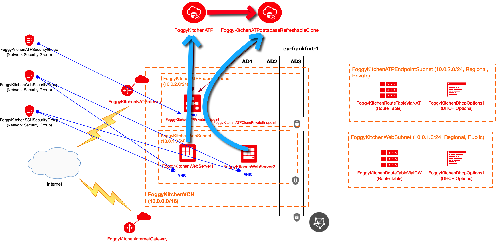

# Terraform OCI ATP Private Endpoint

## Project description

In this repository I have documented my hands-on experience with Terrafrom for the purpose of OCI ATP Private Endpoint deployment. This set of HCL based Terraform files can customized according to any requirements.  

## Topology Diagram 

With the usage of this example HCL code you can build topology documented by diagram below. This topology is extremly simplified for education purposes and rather cannot be used for production implementations. For accessing ATP I am using Flask-based Python code which utilizes OracleInstant Client and cx_Oracle library 
for Python. 



## How to use code 

### STEP 1.

Clone the repo from github by executing the command as follows and then go to terraform-oci-private-atp directory:

```
[opc@terraform-server ~]$ git clone https://github.com/mlinxfeld/terraform-oci-private-atp.git
Cloning into 'terraform-oci-private-atp'...
remote: Enumerating objects: 45, done.
remote: Counting objects: 100% (45/45), done.
remote: Compressing objects: 100% (31/31), done.
remote: Total 45 (delta 19), reused 40 (delta 14), pack-reused 0
Unpacking objects: 100% (45/45), done.

[opc@terraform-server ~]$ cd terraform-oci-private-atp/

[opc@terraform-server terraform-oci-private-atp]$ ls -latr
total 1044
drwx------. 22 opc opc   4096 03-01 17:49 ..
-rw-rw-r--.  1 opc opc   7643 03-01 17:49 README.md
-rw-rw-r--.  1 opc opc    185 03-01 17:49 compartment.tf
-rw-rw-r--.  1 opc opc    657 03-01 17:49 atp_wallet.tf
-rw-rw-r--.  1 opc opc   1524 03-01 17:49 atp.tf
-rw-rw-r--.  1 opc opc    422 03-01 17:49 route2.tf
-rw-rw-r--.  1 opc opc    431 03-01 17:49 route1.tf
-rw-rw-r--.  1 opc opc    238 03-01 17:49 provider.tf
-rw-rw-r--.  1 opc opc    235 03-01 17:49 natgateway.tf
-rw-rw-r--.  1 opc opc    250 03-01 17:49 internet_gateway.tf
-rw-rw-r--.  1 opc opc     83 03-01 17:49 flask_atp.sh
-rw-rw-r--.  1 opc opc    701 03-01 17:49 flask_atp.py
-rw-rw-r--.  1 opc opc    442 03-01 17:49 dhcp_options.tf
-rw-rw-r--.  1 opc opc   4856 03-01 17:49 config_mgmt_on_webserver1.tf
-rw-rw-r--.  1 opc opc    416 03-01 17:49 subnet_webserver.tf
-rw-rw-r--.  1 opc opc    432 03-01 17:49 subnet_atp_endpoint.tf
-rw-rw-r--.  1 opc opc    147 03-01 17:49 sqlnet.ora
-rw-rw-r--.  1 opc opc    775 03-01 17:49 security_group.tf
-rw-rw-r--.  1 opc opc   2605 03-01 17:49 security_group_rule.tf
-rwxrwxr-x.  1 opc opc   1199 03-01 17:49 webserver1.tf
-rw-rw-r--.  1 opc opc    224 03-01 17:49 vcn.tf
-rw-rw-r--.  1 opc opc   1619 03-01 17:49 variables.tf
-rw-rw-r--.  1 opc opc 960361 03-01 17:49 terraform-oci-private-atp.jpg
drwxrwxr-x.  8 opc opc   4096 03-01 17:49 .git
drwxrwxr-x.  3 opc opc   4096 03-01 17:49 .

```

### STEP 2.

Within web browser go to URL: https://www.terraform.io/downloads.html. Find your platform and download the latest version of your terraform runtime. Add directory of terraform binary into PATH and check terraform version:

```
[opc@terraform-server terraform-oci-private-atp]$ export PATH=$PATH:/home/opc/terraform

[opc@terraform-server terraform-oci-private-atp]$ terraform --version

Terraform v0.12.16

Your version of Terraform is out of date! The latest version
is 0.12.17. You can update by downloading from https://www.terraform.io/downloads.html
```

### STEP 3. 
Next create environment file with TF_VARs:

```
[opc@terraform-server terraform-oci-private-atp]$ vi setup_oci_tf_vars.sh
export TF_VAR_user_ocid="ocid1.user.oc1..aaaaaaaaob4qbf2(...)uunizjie4his4vgh3jx5jxa"
export TF_VAR_tenancy_ocid="ocid1.tenancy.oc1..aaaaaaaas(...)krj2s3gdbz7d2heqzzxn7pe64ksbia"
export TF_VAR_compartment_ocid="ocid1.tenancy.oc1..aaaaaaaasbktyckn(...)ldkrj2s3gdbz7d2heqzzxn7pe64ksbia"
export TF_VAR_fingerprint="00:f9:d1:41:bb:57(...)82:47:e6:00"
export TF_VAR_private_key_path="/tmp/oci_api_key.pem"
export TF_VAR_region="eu-frankfurt-1"
export TF_VAR_private_key_oci="/tmp/id_rsa"
export TF_VAR_public_key_oci="/tmp/id_rsa.pub"
export TF_VAR_ATP_ADMIN_password='BEstrO0ng_#11'
export TF_VAR_USER_ADMIN_password='BEstrO0ng_#11'

[opc@terraform-server terraform-oci-private-atp]$ source setup_oci_tf_vars.sh
```

### STEP 4.
Run *terraform init* with upgrade option just to download the lastest neccesary providers:

```
[opc@terraform-server terraform-oci-private-atp]$ terraform init -upgrade

Initializing the backend...

Initializing provider plugins...
- Checking for available provider plugins...
- Downloading plugin for provider "null" (hashicorp/null) 2.1.2...
- Downloading plugin for provider "random" (hashicorp/random) 2.2.1...
- Downloading plugin for provider "local" (hashicorp/local) 1.4.0...
- Downloading plugin for provider "oci" (hashicorp/oci) 3.64.0...

The following providers do not have any version constraints in configuration,
so the latest version was installed.

To prevent automatic upgrades to new major versions that may contain breaking
changes, it is recommended to add version = "..." constraints to the
corresponding provider blocks in configuration, with the constraint strings
suggested below.

* provider.local: version = "~> 1.4"
* provider.null: version = "~> 2.1"
* provider.random: version = "~> 2.2"

Terraform has been successfully initialized!

You may now begin working with Terraform. Try running "terraform plan" to see
any changes that are required for your infrastructure. All Terraform commands
should now work.

If you ever set or change modules or backend configuration for Terraform,
rerun this command to reinitialize your working directory. If you forget, other
commands will detect it and remind you to do so if necessary.
```

### STEP 5.
Run *terraform apply* to provision the content of this code (type **yes** to confirm the the apply phase):

```
[opc@terraform-server terraform-oci-private-atp]$ terraform apply 

An execution plan has been generated and is shown below.
Resource actions are indicated with the following symbols:
  + create
 <= read (data resources)

Terraform will perform the following actions:

  # data.oci_core_vnic.FoggyKitchenWebserver1_VNIC1 will be read during apply

(...)

Plan: 26 to add, 0 to change, 0 to destroy.

Do you want to perform these actions?
  Terraform will perform the actions described above.
  Only 'yes' will be accepted to approve.


(...)

Apply complete! Resources: 26 added, 0 changed, 0 destroyed.

Outputs:

FoggyKitchenWebserver1_PublicIP = [
  "158.101.165.174",

(...)

```

### STEP 6.
Confirm that Flask-based webserver accessed succefully ATP and it can show database name (pick up Public IP of webserver from the step 5):

```
[opc@terraform-server terraform-oci-private-atp]$ curl http://158.101.165.174/
I am connected to ATP Database via private endpoint! ATP dbname taken from v$database view is EYB1POD

[opc@terraform-server terraform-oci-private-atp]$
```


### STEP 7.
After testing the environment you can remove the whole OCI infra. You should just run *terraform destroy* (type **yes** for confirmation of the destroy phase):

```
[opc@terraform-server terraform-oci-private-atp]$ terraform destroy

oci_identity_compartment.FoggyKitchenCompartment: Refreshing state... [id=ocid1.compartment.oc1..aaaaaaaagillnk7ttj6wpdhmewpibpxc5gbmrfxdtmaa3gfgjzbudesm3tsq]
oci_core_virtual_network.FoggyKitchenVCN: Refreshing state... [id=ocid1.vcn.oc1.eu-frankfurt-1.amaaaaaadngk4gialu6ikx45brprlpzi2oyibbsl6slts36bar4vgcjlmgjq]
(...)

Plan: 0 to add, 0 to change, 26 to destroy.

Do you really want to destroy all resources?
  Terraform will destroy all your managed infrastructure, as shown above.
  There is no undo. Only 'yes' will be accepted to confirm.

  Enter a value: yes

(...)

oci_core_network_security_group.FoggyKitchenWebSecurityGroup: Destruction complete after 5s
oci_core_virtual_network.FoggyKitchenVCN: Destroying... [id=ocid1.vcn.oc1.iad.amaaaaaac3adhhqat3gn63eiilexiwzgyrjoi6few7dcf36ilddupukf6mpa]
oci_core_virtual_network.FoggyKitchenVCN: Destruction complete after 1s
oci_identity_compartment.FoggyKitchenCompartment: Destroying... [id=ocid1.compartment.oc1..aaaaaaaarrlkyjshc4i7gqr56sydav2lpcdhhqwy2b72mj6iruy3r4z3j7ra]
oci_identity_compartment.FoggyKitchenCompartment: Destruction complete after 0s

Destroy complete! Resources: 26 destroyed.
```
